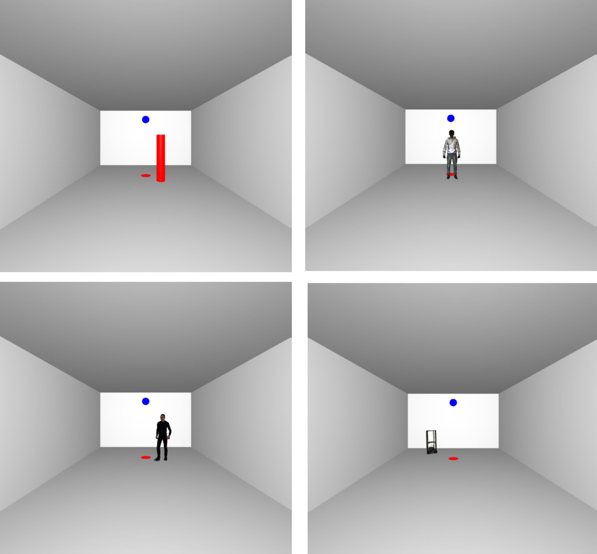

# VR-Experiment-Project
**Group members:**    
Hoang Nam Nguyen　email:hoang.nam.nguyen@etu.univ-st-etienne.fr         
Uzairu Abubakar  email:uzairu.abubakar@etu.univ-st-etienne.fr   
Tatsuto Yamauchi  email:tatsuto.yamauchi@etu.univ-st-etienne.fr

　Please check the 'Human Behavior Experiment in Virtual Reality.pdf' file for the idea of this project and 'Healthy young adults implement distinctive avoidance strategies while walking and circumventing virtual human vs. non-human obstacles in a virtual environment' paper for the research idea.

# VR experiment environment

　We use Three.js to simulate the experiments.
In VR mode, the participant will stay in a room: 5m width x 7.5m depth x 4m height. The lighting condition in the room is set to a moderated level.
There are 3 types of obstacles:

- Cylinder: 1.65m height
- Virtual Human (static and animation): 1.70m height
- Mobility Robot: 90cm height
The scales of the room and obstacles are made to fit with the limitation boundary of Meta Oculus 2.

In the experiment, there are 3 initial positions: left, head-on, and right. In each trial, obstacles in 1 of 3 positions will randomly move to approach the participant. Participant needs to avoid it when walking from the starting point (green) to the (ending point) red, we also add a torwarding point (blue) on the wall same as in the previous study. After reaching the red point, the participant will come back to the starting point to be ready for the next trial.

There are 9 trials for each experiment condition of obstacles. The first 3 are used for training and preparation time. The last 6 trials will be used to analyze the results.



# 3D Model Creation and Animation

## 1. Virtual Human Static model and Mobility Robot Model

 We captured the model using LumaAI, Models from Luma AI are not background dependent, the background is automatically segmented in the preprocessing stage.

## 2.  Virtual Human Animation

1. We captured the model using LumaAI, Models from Luma AI are not background dependent, the background is automatically segmented in the preprocessing stage.
2. We used Blender to get an appropriate orientation of the model. Such as the direction and rotation.
3. We use Mixamo to place markers on the joints of model and then apply walking animation as required by our experiment.
4. Finally, we exported the animated model as Fbx file and visualized it using three.js.

However, for a better visualize representation (resolution, movement) of the model for a good experiment, we utilized an available virtual human model online for our experiment.

# Server

## 1. Why does a server needed?

- **To use HMDs without cables**
    
    This allows the body to move more freely.
    
- **To enable experiments to be conducted anywhere**
    
    With an HMD and enough space, experiments can be conducted simply by accessing a browser.
    
- **To save data of human behavior obtained from the HMD**
    
    Data obtained from the HMD is stored in the CLOUD through the SERVER.
    

## 2. Server details

### 2-1. Google Cloud

　Google Cloud is a cloud computing platform provided by Google. A server was built using Google Cloud to enable file upload to google drive.

- **Compute Engine API**
    
    The service provided a virtual machine (VM) and used Ubuntu 20.04 as the computer for the server.
    
- **Google Drive API**
    
    A program interface (API) for using Google Drive functions. This is used to upload data obtained from the HMD from the server to google drive as CSV files.
    

### 2-2. Apache

　Apache was used as the web server software. The Apache HTTP Server is responsible for receiving HTTP requests from clients and serving static web pages and dynamic content (scripts and applications). Apache acts as a proxy, forwarding requests from clients to the Node.js server.

### 2-3. Node.js

　Node.js was used to build the web server. Node.js enables server-side application development using JavaScript. The following are the functions of the server.

- Provision of html files for conducting experiments.
- Get experimental data from clients.
- Access google drive and upload the data obtained.

### 2-4. URL

　The SSL certificate for HTTPS communication is a Self-Signed Certificate.


## 3. How to launch the server

1. **To access a Google Cloud VM using SSH**
2. **Launching Apache**

```jsx
sudo systemctl start apache2
```

1. **Launch the Node.js server.**

```jsx
node server.js
```

# Result and Analysis

1. The results from the experiment is stored in Google Drive.
2. Download the csv file from Google Drive and copy it to the 'csv' folder.
3. Then open the analysis.m in Matlab and run entire the script:
    - The csv data will be converted to a table in 'mat' file and will be stored in 'Table' folder.
    - The figure of graphs ( Probability of right/left circumvention & Path of participants every trial ) will be stored in 'fig' folder.
    - The data of each trial will be stored in 'TrialData' folder.

# Future work

- Stronger server with better performance and safer security.
- Better VR user experience.
- Apply GUI to modify different experiment parameters, different obstacle sizes, and different kinds of 3D human models (weight, height, country, etc.) to fit with participants profile.
- Collect data from some people to observe human behavior of avoidance strategy.
